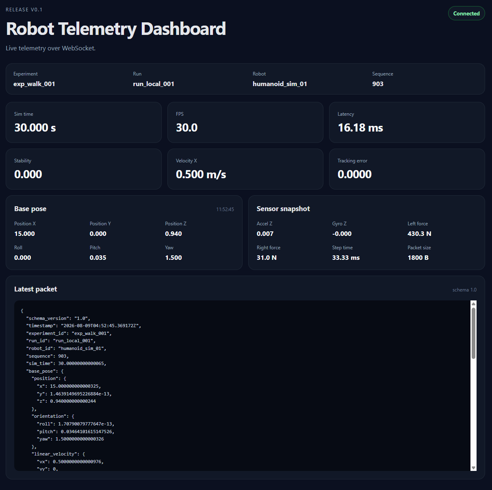

# Robot Simulation Telemetry Dashboard

A lightweight real-time telemetry dashboard for a robot simulator. The v0.1 release provides an end-to-end WebSocket pipeline from the simulator to FastAPI and then to a browser dashboard.



## Current release

**Version:** `v0.1.0 — Live Telemetry MVP`

The current release focuses on one goal: prove that generated robot telemetry can be validated by the backend and streamed to a browser in real time.

## Architecture

```text
+-------------------+
| Robot Simulator   |
| TelemetryGenerator|
+---------+---------+
          |
          | WebSocket
          | /ws/telemetry
          v
+---------------------------+
| FastAPI Backend           |
|                           |
| - Validate Pydantic schema|
| - Return ACK / error      |
| - Broadcast telemetry     |
+-------------+-------------+
              |
              | WebSocket
              | /ws/dashboard
              v
+---------------------------+
| Browser Dashboard         |
|                           |
| - Connection status       |
| - Latest telemetry        |
| - Key metrics             |
| - Pose / sensor snapshot  |
| - Raw JSON                |
+---------------------------+
```

## Project structure

```text
.
├── backend/
│   ├── app/
│   │   ├── main.py
│   │   ├── schemas/
│   │   │   └── telemetry.py
│   │   ├── streaming/
│   │   │   └── websocket_manager.py
│   │   └── tests/
│   │       ├── conftest.py
│   │       └── test_main_backend.py
│   ├── requirements.txt
│   └── requirements-dev.txt
│
├── frontend/
│   ├── index.html
│   ├── app.js
│   ├── styles.css
│   └── README.md
│
└── README.md
```

## Features in v0.1

### Simulator → Backend

- WebSocket telemetry ingestion through `/ws/telemetry`
- Pydantic validation for telemetry packets
- ACK response for accepted packets
- Structured validation error response for invalid packets

### Backend → Dashboard

- Dashboard subscription through `/ws/dashboard`
- In-memory WebSocket connection manager
- Live telemetry broadcast to connected dashboard clients
- Automatic removal of disconnected clients

### Dashboard

- WebSocket connection status
- Automatic reconnect
- Latest experiment, run and robot identifiers
- Sequence and simulation time
- FPS, latency, stability score and tracking error
- Base pose and velocity
- IMU and foot-contact data
- Raw telemetry JSON

### Backend utility

- Health endpoint: `GET /health`
- Frontend served directly by FastAPI

## Requirements

Recommended:

- Python 3.11+
- `pip`

The simulator additionally needs:

- `PyYAML`
- `websockets`

## Setup

From the project root, create a virtual environment:

### Windows PowerShell

```powershell
python -m venv .venv
.venv\Scripts\Activate.ps1
```

### macOS / Linux

```bash
python -m venv .venv
source .venv/bin/activate
```

Install backend and test dependencies:

```bash
pip install -r backend/requirements-dev.txt
```

## Run the backend and dashboard

From the project root:

```bash
uvicorn backend.app.main:app --reload --port 8000
```

Open the dashboard:

```text
http://localhost:8000
```

Health check:

```text
http://localhost:8000/health
```

Expected response:

```json
{
  "status": "ok"
}
```

## Connect the simulator

The simulator must connect to:

```text
ws://localhost:8000/ws/telemetry
```

A minimal sender loop looks like this:

```python
import asyncio
import json

import websockets


async def stream(generator, total_steps: int, frequency_hz: float) -> None:
    sleep_sec = 1.0 / frequency_hz

    async with websockets.connect(
        "ws://localhost:8000/ws/telemetry"
    ) as websocket:
        for _ in range(total_steps):
            packet = generator.next_packet()

            await websocket.send(json.dumps(packet))

            print(
                f"seq={packet['sequence']} "
                f"sim_time={packet['sim_time']:.3f}"
            )

            await asyncio.sleep(sleep_sec)
```

> `asyncio.sleep(...)` must be awaited. Without `await`, a 30-second simulation can finish almost immediately because the loop never actually pauses between packets.

## Telemetry packet

The backend currently validates the following top-level structure:

```json
{
  "schema_version": "1.0",
  "timestamp": "2026-08-09T02:30:00+00:00",
  "experiment_id": "exp_walk_001",
  "run_id": "run_local_001",
  "robot_id": "humanoid_sim_01",
  "sequence": 1,
  "sim_time": 0.033,
  "base_pose": {},
  "sensors": {},
  "metrics": {},
  "events": []
}
```

The detailed schema is defined in:

```text
backend/app/schemas/telemetry.py
```

## WebSocket API

### `/ws/telemetry`

Used by the simulator to publish telemetry packets.

For a valid packet, the backend returns:

```json
{
  "type": "ack",
  "sequence": 1
}
```

For an invalid packet, the backend returns:

```json
{
  "type": "error",
  "error": "invalid_telemetry",
  "detail": []
}
```

### `/ws/dashboard`

Used by browser clients to subscribe to live telemetry.

Broadcast message format:

```json
{
  "type": "telemetry",
  "data": {
    "sequence": 1,
    "sim_time": 0.033
  }
}
```

## Run tests

From the project root:

```bash
pytest backend/app/tests -v
```

The v0.1 test suite covers:

- `GET /health`
- ACK for a valid telemetry packet
- Error response for invalid telemetry
- End-to-end broadcast from `/ws/telemetry` to `/ws/dashboard`
- Frontend static-file serving

## Manual smoke test

Before merging a release branch into `main`:

1. Start FastAPI.
2. Open `http://localhost:8000`.
3. Confirm the dashboard reports a connected WebSocket.
4. Start the simulator.
5. Confirm `sequence` and `sim_time` update continuously.
6. Confirm pose, sensors and metrics update.
7. Stop the simulator and verify the backend remains healthy.
8. Run the complete pytest suite.

## Release status

### v0.1 — Live Telemetry MVP

- [x] Telemetry generator integration
- [x] WebSocket telemetry ingestion
- [x] Telemetry schema validation
- [x] ACK / validation-error messages
- [x] Dashboard WebSocket broadcast
- [x] Basic live browser dashboard
- [x] Backend integration tests

## Roadmap

### v0.2 — Persistence and Replay

- [ ] Save validated packets to JSONL
- [ ] Store experiment and run metadata
- [ ] List experiments and runs
- [ ] Load historical telemetry
- [ ] Replay packets according to `sim_time`
- [ ] Live / Replay mode in the dashboard
- [ ] Replay speed controls

### v0.3 — Realtime Visualization

- [ ] Rolling telemetry buffer
- [ ] Velocity chart
- [ ] FPS and latency charts
- [ ] Roll / pitch / yaw charts
- [ ] Tracking-error chart
- [ ] Event and anomaly timeline

### v0.4 — Multi-run / Multi-robot

- [ ] WebSocket rooms by experiment and run
- [ ] Multiple simultaneous simulations
- [ ] Experiment / run selector
- [ ] Robot-specific subscriptions

### v0.5 — Fault Injection

- [ ] Packet drop simulation
- [ ] Latency spikes
- [ ] Sensor noise and drift
- [ ] Instability / fall events
- [ ] Additional sensor and joint telemetry

### v0.6 — Deployment and Reliability

- [ ] Docker
- [ ] CI pipeline
- [ ] Linting and type checks
- [ ] Structured backend logging
- [ ] WebSocket load testing
- [ ] Graceful shutdown

## Release workflow

Suggested release tag:

```text
v0.1.0
```

Example:

```bash
git add .
git commit -m "feat: release live telemetry MVP"
git push origin <feature-branch>
```

After validation and merge into `main`:

```bash
git tag -a v0.1.0 -m "Live Telemetry MVP"
git push origin v0.1.0
```
